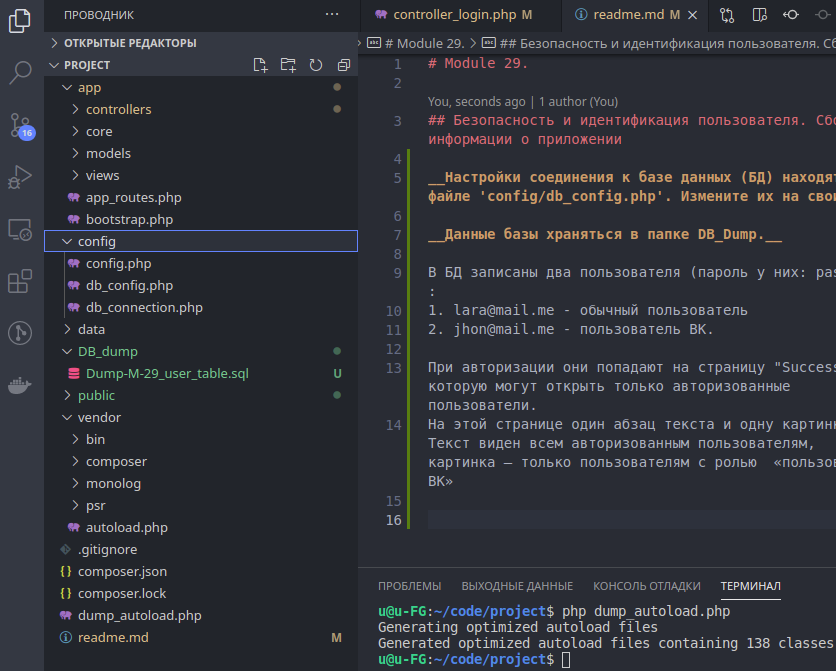

# Module 29.

## Безопасность и идентификация пользователя. Сбор информации о приложении 

__Настройки соединения к базе данных (БД) находятся в файле 'config/db_config.php'. Измените их на свои.__

__Данные базы храняться в папке DB_Dump.__

В БД записаны два пользователя (пароль у них: password):
1. lara@mail.me - обычный пользователь
2. jhon@mail.me - пользователь ВК.

При авторизации они попадают на страницу "Success", которую могут открыть только авторизованные пользователи.
На этой странице один абзац текста и одну картинку. Текст виден всем авторизованным пользователям, картинка — только пользователям с ролью  «пользователь ВК»

Неудачные попытки входа записываются в файл "/public/access_log.log"

